# McDuo's
People can like (or skip) each other based on a fun / crazy photo taken with a 
McDonalds product that he / she likes best. This way they can get to know people
who love the same product of the McDonalds as much as they do. In this way
beautiful friendships can develop!

I designed the application for the Iphone X, it's not responsive.

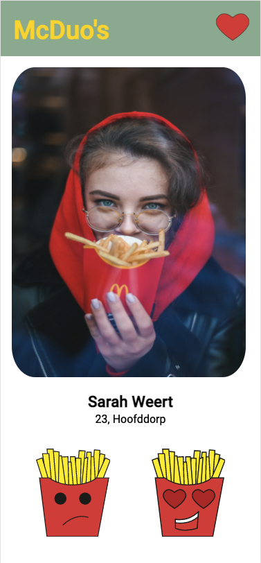
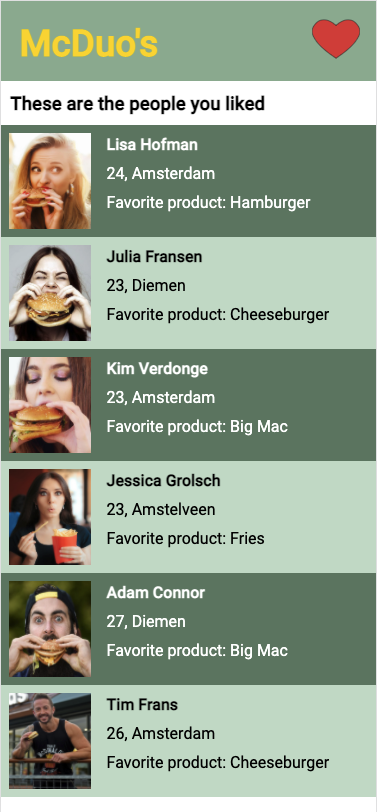

## Installation
1. Clone this repository 
   
    ``` git clone https://github.com/lottekoblens/matching-application.git ```
1. Navigate to the folders root
1. run `npm install`
1. Set up your database with MongoDb and add these profiles

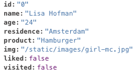
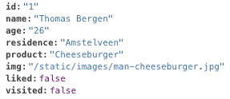
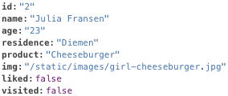
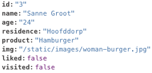
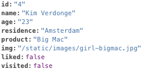
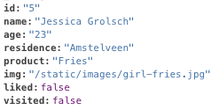
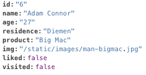
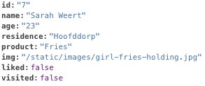
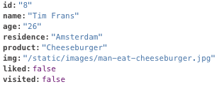
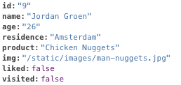

5. Setup environment variables
   - DB_HOST = Host string that you use for your MongoDB
   - DB_USER = Username that you use for your MongoDB
   - DB_PASS = Password that you use for your MongoDB

## Usage
1. Start the server with `npm start`
1. Go to localhost:3000 in your browser to use the app

## Live version with Digital Ocean
https://matching-application-lk46y.ondigitalocean.app/

## License
[MIT][license]

[license]: https://github.com/lottekoblens/matching-application/blob/master/LICENSE
